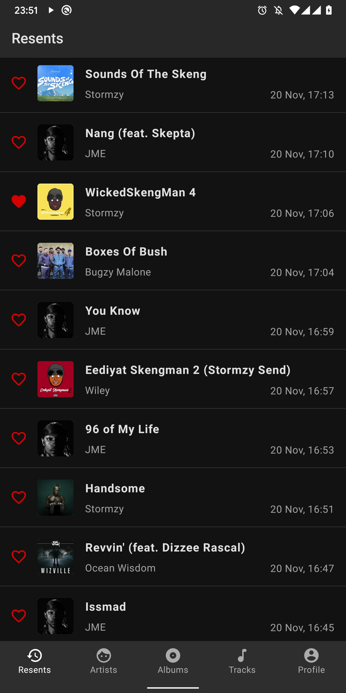
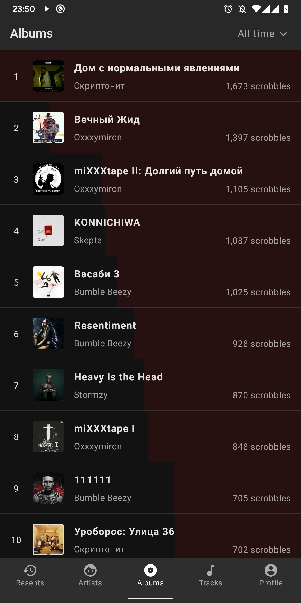
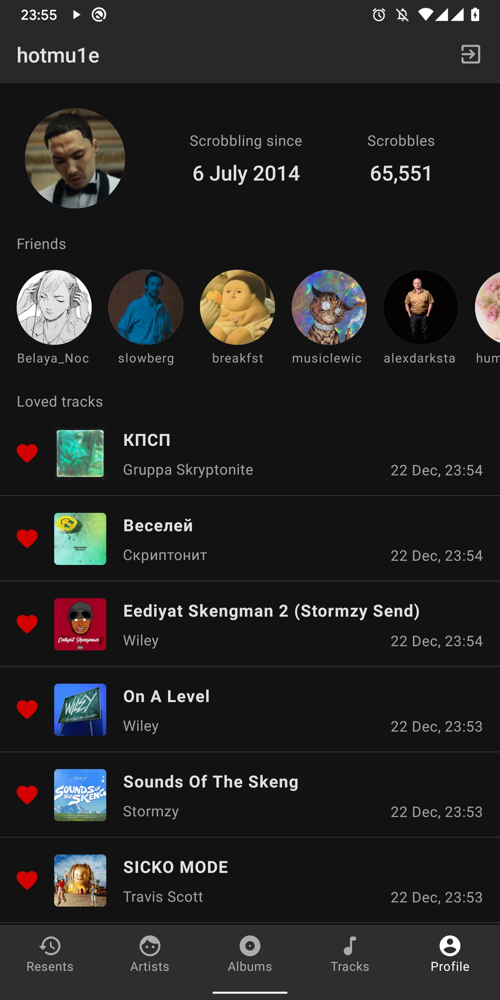
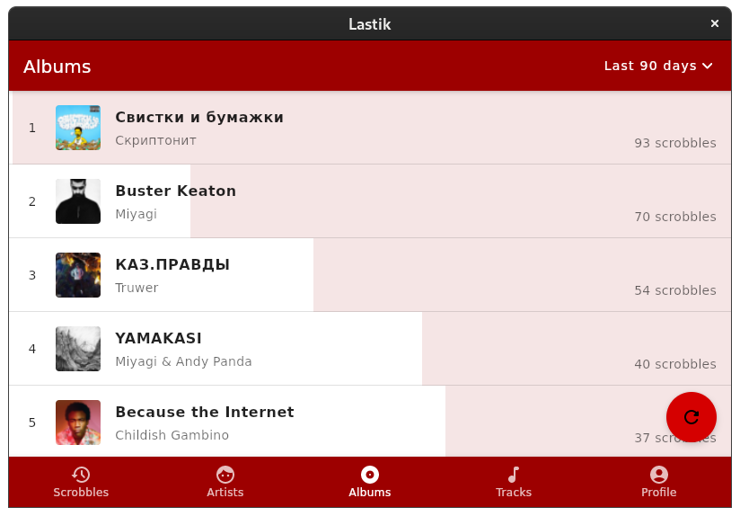

# Lastik
Kotlin Multiplatform + Jet(pack)Brains Compose pet project, based on last.fm/api (in development)

### Currently supported platforms
- Android - priority
- Desktop - as a Proof of Concept

### Used libraries

- Architecture
    - [Kodein](https://github.com/Kodein-Framework/Kodein-DI)
    - [MVIKotlin](https://github.com/arkivanov/MVIKotlin)
    - [Decompose](https://github.com/arkivanov/Decompose)
- Data
    - [Ktor](https://github.com/ktorio/ktor)
    - [SQLDelight](https://github.com/cashapp/sqldelight)
    - [Multiplatform Settings](https://github.com/russhwolf/multiplatform-settings)
- UI
    - [Compose for Desktop](https://github.com/jetbrains/compose-jb)
    - [Accompanist](https://github.com/google/accompanist)
        - [Coil](https://github.com/google/accompanist/tree/main/coil)
        - [Insets](https://github.com/google/accompanist/tree/main/insets)  
        - [Swipe Refresh](https://github.com/google/accompanist/tree/main/swiperefresh)
- Kotlinx
  - [Coroutines](https://github.com/Kotlin/kotlinx.coroutines)
  - [Serialization](https://github.com/Kotlin/kotlinx.serialization)  
- Other
    - [Kermit](https://github.com/touchlab/Kermit)
    - [Krypto](https://github.com/korlibs/krypto)
    - [Chrome Custom Tabs](https://developer.chrome.com/docs/android/custom-tabs/overview/)
    - [Gradle Versions Plugin](https://github.com/ben-manes/gradle-versions-plugin)

### Screenshots
  
